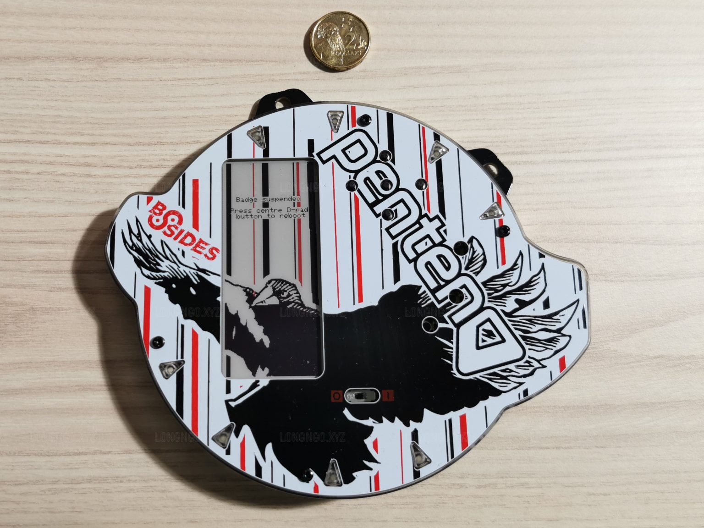
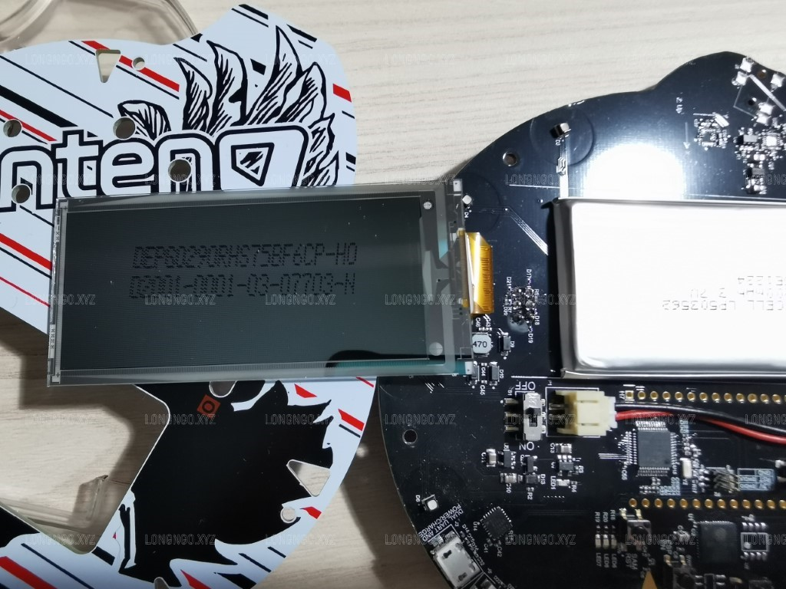
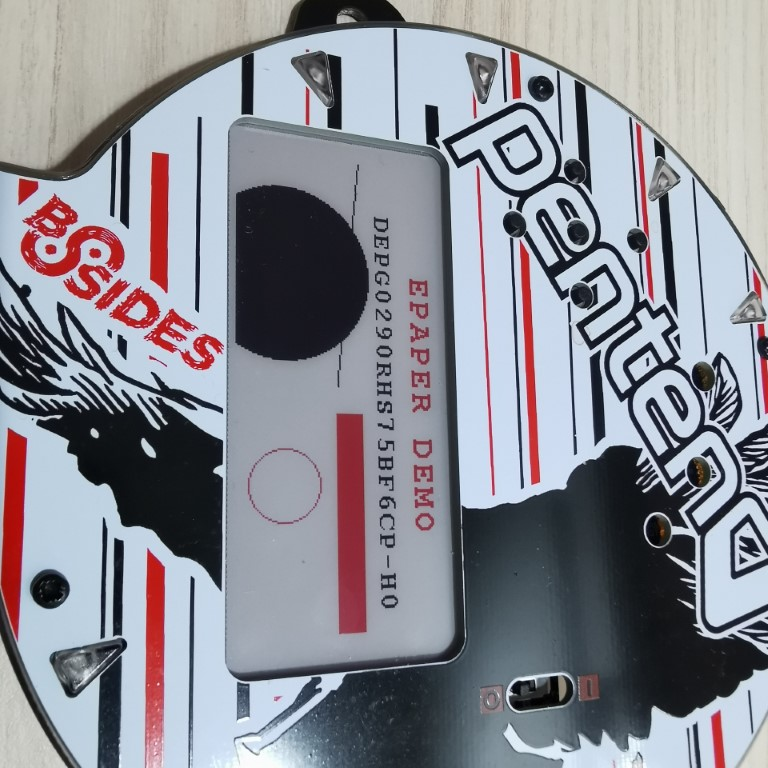

# a 2.9" tri-color Black/White/Red epaper driver for ESP32

This library helps ESP32 to communicate with a 2.9" epaper, which is used in the electronic  badge of Bsides CBR 2021 conference ( https://www.bsidesau.com.au/ )

## epaper models
The model of the epaper display is DEPG0290RHS75BF6CP-H0 , and I have not been able to find its datasheet. The manufacture is likely to be DKE, but I have not been able to confirm.

However, the structure of the driver and the example code can be applied to other tri-color epaper displays whose model names start with "DEPG". For example, epaper models DEPG0290R*, DEPG0290Y* may be used in the same way with little modification. 

## Usage
Please see the example which should help to understand how to use this library. 

This project must be compiled by ESP-IDF, which is guided here https://docs.espressif.com/projects/esp-idf/en/latest/esp32/get-started/

The result should look as follows

## Credits
This library was based on the code at https://github.com/krzychb/esp-epaper-29-dke and adapted to be working with the display model mentioned above.

I also got some useful help from the arduino forum at https://forum.arduino.cc/t/need-help-for-a-dke-2-9-epaper/892275/8 .

## License
[Apache License Version 2.0, January 2004](LICENSE).

Modifications copyright (C) 2021 longngo.net

